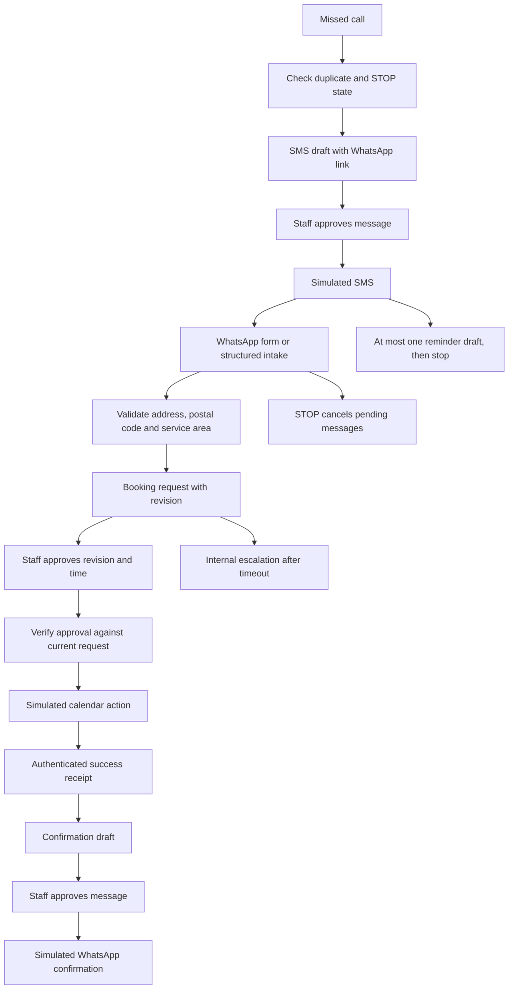

# Missed call booking

A missed call creates an SMS draft that directs a customer to WhatsApp intake. Structured details become a booking request. Staff approve the current request before a calendar action can run, and a successful calendar receipt creates a confirmation draft.

**This is an offline n8n template with fictional customer records.** It has not been imported into a running n8n instance. Provider integrations are adapter placeholders. It is not a deployed customer service.

## Try it in 60 seconds

Tested with Node.js 24.14.1 on macOS 15.7.3. Lower Node.js versions have not been tested. No packages, services, credentials or internet connection are needed.

```sh
node demo.js build
node demo.js check
```

The build prints every conversation and final state. [scenarios.json](scenarios.json) contains the events and explicit expected outcomes. [output/transcripts.json](output/transcripts.json) preserves the full replay.

Expected check result: `CHECK PASS 22/22 scenarios`.



All outbound messages, including the first SMS and reminders, require a separate staff decision. This deliberately follows the demo's rule that irreversible actions need human confirmation. Preparing the request is automatic; sending it is gated.

## Import and configure

1. In an n8n editor, create a workflow and use **Import from File** to select [workflow.json](workflow.json). The export is inactive and uses built-in nodes: Manual Trigger, Webhook, Schedule Trigger, Code, If, HTTP Request and Sticky Note. Import compatibility still needs a real n8n check.
2. Keep `dryRun: true`. Run **Manual demo**. This replays a full conversation in one execution, uses isolated state, and emits no outbound HTTP actions. Read **Review queue** for the transcript and simulated actions.
3. **Business configuration** is the single variable block: business hours/days/timezone, service postal prefixes, duplicate window, reminder/stop intervals, escalation interval, test WhatsApp number and adapter base URL. The local builder takes the same values from `config.json`. Defaults use UTC and an example service-area configuration. Change local config/source and run `build` to regenerate the JSON; do not edit generated Code nodes independently.
4. For sandbox webhook experiments, create three different Header Auth credentials: customer-provider ingress, staff decisions, and calendar-adapter receipts. Bind them to the matching placeholder credential slots. The fourth credential authenticates outgoing requests to an adapter. Never put secrets into the exported JSON. n8n supports authenticated webhook nodes; see its [Webhook documentation](https://docs.n8n.io/integrations/builtin/core-nodes/n8n-nodes-base.webhook/).
5. Send events in the shape shown below. Customer payloads cannot choose their actor: each authenticated route overwrites it and restricts permitted event types. The staff route must be reachable only by the staff tool. Customer-provider adapters must validate provider signatures and bind the phone to the sender; this template does not implement provider-specific verification.
6. The timer uses one-minute ticks. Multi-execution prototype state uses workflow static data. n8n documents that static data is not saved in test executions and can be unreliable with frequent executions. The single-run manual demo avoids depending on persistence. See [n8n's static-data reference](https://github.com/n8n-io/n8n-docs/blob/main/docs/build/code-in-n8n/cookbook/built-in-methods-and-variables-examples/getworkflowstaticdata.md).

### Accounts needed for a future integration

- An n8n workspace or self-hosted instance.
- A telephony/SMS account providing missed-call events and SMS delivery.
- A WhatsApp Business messaging account and a form or structured intake adapter.
- A calendar account with write access restricted to the intended calendar.
- An authenticated staff review interface and a durable queue/database for production state.

**Costs: check with your service providers.**

### Event contract

The offline event wrapper is `{ "channel": "customer", "body": { ... } }`. Webhooks receive only `body`, assign the actor from their route and assign the receipt timestamp themselves. Keep each event ID unique and stable across provider retries.

| Route | Allowed events | Required additional fields |
| --- | --- | --- |
| Customer intake | `missed_call` | `id`, `phone` |
| Customer intake | `message` | `id`, `phone`, `text`; case-insensitive trimmed `STOP` opts out |
| Customer intake | `details` | `id`, `phone`, `details` with name, issue, address, postal, preference (`callback` or `visit`) |
| Staff decisions | `approve_message` | `id`, `phone`, `messageId` from Review queue, `approved: true` |
| Staff decisions | `approve_booking` | `id`, `phone`, current `revision`, `approved: true`, future ISO `start` and `end` |
| Calendar receipts | `calendar_result` | `id`, `phone`, `bookingKey`, `success`, and a nonempty `providerEventId` on success |

Example structured details for a fictional customer. Postal codes `K1A 0B1` and `H0H 0H0` in the fixtures are public format examples that may be assigned in the real world; they are not claimed to be fictional or tied to the example customer/address. Names, issues and customer records are invented, and phone numbers use the reserved test range.

```json
{
  "id": "intake-example-01",
  "type": "details",
  "phone": "+12025550101",
  "details": {
    "name": "Test Customer 01",
    "issue": "Synthetic leaking fixture",
    "address": "123 Example Road",
    "postal": "K1A 0B1",
    "preference": "visit"
  }
}
```

There is no natural-language agent in this demo. A WhatsApp form/adapter must collect these fields, or staff can enter them. A plain-text message creates a receipt log entry and is never silently interpreted as a booking; no case-insensitive fragment of 20 or more characters from the message body is copied into that log entry.

## Failure handling

| Situation | Behaviour covered by the simulator |
| --- | --- |
| Repeated missed calls | Suppress repeats within five minutes; retain an already-open conversation even after the window |
| Plain-text booking request | Log receipt with an internal instruction to collect structured intake; keep request revision at zero and create no booking or outbound message |
| Customer never replies | One reminder draft after 30 minutes from the approved initial message; stop at 90 minutes; an expired reminder approval cannot send |
| Customer says STOP | Persist opt-out and cancel queued messages; later missed calls and staff approvals cannot re-enable contact |
| Outside business hours | First draft states that staff will review when open; it does not promise emergency coverage |
| Staff does not confirm | Add one internal escalation after 45 minutes; no calendar action occurs |
| Invalid address/postal code | Block the request and draft a clarification; format checking is not geocoding |
| Outside service area | Reject a postal prefix outside the configured list |
| Details change after review | Increment request revision; old approvals fail |
| Repeated approval | One calendar action per accepted revision in serial state; repeat event IDs and later repeated approval requests do not create another action |
| Calendar write fails | Mark staff action required; do not draft customer confirmation |
| Forged approval in customer input | Reject the event type and ignore user-supplied actor fields |
| STOP arrives with an old timestamp | Apply opt-out before ordinary event ordering checks |

Callbacks still require address/postal details in this demonstration because eligibility is checked before either service preference. Staff select the time; customer messages do not reserve calendar capacity.

## Check the guard, including a broken workflow

```sh
node demo.js check
node demo.js break
```

The checker verifies connection sources/targets, 26 node contracts, five entry points, credentials/test-number defaults and graph reachability. Removing **Staff booking guard** makes **Write calendar** and **Calendar simulated** unreachable; removing **Staff message guard** makes **Send message** and **Message simulated** unreachable. It also executes the actual embedded guard with a forged action, verifies that the customer route rejects booking approvals, asserts that a plain-text customer's message body is absent from the receipt log, and runs all 22 scenarios against the actual embedded state-machine code, comparing saved transcripts with fresh results.

The included `.gitattributes` keeps source and generated JSON at LF under `core.autocrlf=true`, because the export embeds and compares the state-machine source exactly. The GitHub Actions workflow is configured to run the untouched export on Ubuntu, Windows and macOS with Node 20. Checks in this folder were run locally on macOS; cross-system results should be confirmed on the repository's Actions page after publication.

`break` tests three separate mutations in temporary copies inside this demo folder:

| Mutation | Required failure from the real checker |
| --- | --- |
| Add Customer intake -> Write calendar | `FAIL: approval bypass reaches Write calendar` |
| Replace the approval guard with a no-op, then rebuild | `FAIL: Missing expected exception: Staff booking guard accepted forged calendar action` |
| Allow `approve_booking` on the customer route, then rebuild | `FAIL: Missing expected exception: Customer intake route accepted approve_booking event` |

Each checker process must exit 1. The demonstration command returns 0 only after observing all three specific failures, and removes its temporary copies; the original source and export stay intact. Process creation and write access to this demo folder are required.

## Limits before real use

- The supplied workflow stays in dry-run mode and accepts only reserved North American `555-01xx` test numbers. NANPA describes that reservation in [555 line numbers](https://nanpa.com/numbering/555-line-numbers). The WhatsApp link illustrates routing; the fictional number has no live account.
- The HTTP nodes describe adapter contracts at `https://adapter.invalid/calendar` and `/message`; no provider adapter is included. The message adapter must route by action kind and enforce approved WhatsApp templates/windows, consent and sender identity. Those provider policies were not exercised here.
- A calendar adapter must deduplicate by `bookingKey`, verify availability and send an authenticated success/failure receipt. Message adapters must deduplicate by `messageId` within their deployment. Delivery failures go to a staff-action output, with retries disabled. A timeout is an unknown outcome until reconciled with the provider.
- `sent_simulated` records an approved dispatch, not proof of provider delivery. No success receipt is fabricated. The offline normal scenario supplies its own clearly synthetic receipt.
- Static data does not provide atomic concurrency, crash recovery, durable opt-outs or a bounded history. Before real use, replace it with a transactional state/outbox store and recheck consent/revision at dispatch time. Serial tests do not prove that STOP and an in-flight request cannot race. Stopping contact does not automatically delete an already-created calendar event.
- The internal escalation is visible in Review queue; external staff notifications and the staff interface are integration work. The current export cannot be presented as a turnkey live service.
- Address syntax and postal prefixes do not prove an address exists. There is no geocoding, availability solver, appointment cancellation/rescheduling or emergency triage. Do not use this for urgent repairs that need a human dispatcher.

MIT licensed. Copyright 2026 Nick Lian.
